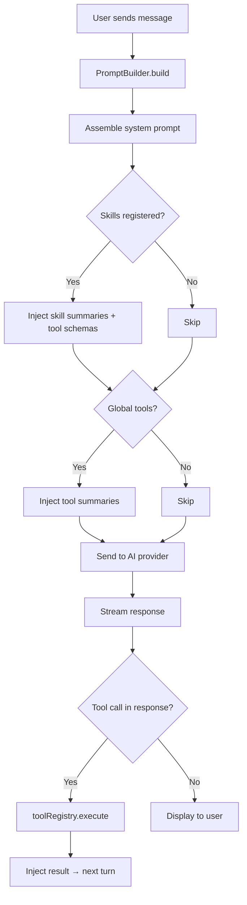

# ✦ Aura Widget

A **production-grade, framework-agnostic AI chat widget** built as a Web Component library with [Lit 3.x](https://lit.dev/). Drop `<aura-chat>` into any application — vanilla JS, React, Angular, Vue — and get a fully featured AI assistant with streaming, skills, tools, conversation history, and theming out of the box.

<!-- screenshot / GIF placeholder -->
<!--  -->

---

## Table of Contents

- [Quick Start](#quick-start)
- [AuraConfig Reference](#auraconfig-reference)
- [AI Provider Guide](#ai-provider-guide)
- [Skills Guide](#skills-guide)
- [Tools Guide](#tools-guide)
- [Custom Message Components](#custom-message-components)
- [Theming](#theming)
- [Demo](#demo)
- [Architecture](#architecture)
- [Contributing](#contributing)
- [License](#license)

---

## Quick Start

### Install

```bash
npm install aura-widget
```

### Basic Usage

```html
<script type="module">
  import 'aura-widget';
</script>

<aura-chat id="chat"></aura-chat>

<script type="module">
  const chat = document.getElementById('chat');

  chat.config = {
    identity: {
      appId: 'my-app',
      ownerId: 'org-1',
      tenantId: 'tenant-1',
      userId: 'user-1',
      aiName: 'Aria',
    },
    header: { title: 'Aria' },
    welcome: {
      title: 'Hello!',
      message: 'How can I help you today?',
      suggestedPrompts: [
        { label: '👋 Say hello', prompt: 'Hello!' },
      ],
    },
    providers: [
      { type: 'built-in', providerId: 'openai', apiKey: 'sk-...' },
    ],
    behavior: {
      systemPrompt: 'You are a helpful assistant.',
      temperature: 0.7,
      maxTokens: 4096,
    },
    conversation: {
      async createConversation() { /* ... */ },
      async listConversations() { /* ... */ },
      async getMessages(id) { /* ... */ },
      async saveMessage(id, msg) { /* ... */ },
    },
    ui: { theme: 'dark' },
  };
</script>
```

---

## AuraConfig Reference

```typescript
interface AuraConfig {
  identity: IdentityConfig;     // App, tenant, user identification
  header: HeaderConfig;         // Title + optional icon
  welcome: WelcomeConfig;       // Welcome screen content + suggested prompts
  providers: AIProviderConfig[];// Built-in or custom AI providers
  behavior: AIBehaviorConfig;   // System prompt, skills, tools, parameters
  conversation: ConversationHistoryProvider; // CRUD for conversations
  onEvent?: (event: AuraEvent) => void;     // Event callback
  ui: UIConfig;                 // Theme, custom components, settings control
}
```

### IdentityConfig

| Property   | Type     | Description                 |
|------------|----------|-----------------------------|
| `appId`    | `string` | Application identifier      |
| `ownerId`  | `string` | Organisation / owner ID     |
| `tenantId` | `string` | Tenant identifier           |
| `userId`   | `string` | Current user identifier     |
| `aiName`   | `string` | Display name for the AI     |

### AIBehaviorConfig

| Property               | Type                        | Description                            |
|------------------------|-----------------------------|----------------------------------------|
| `systemPrompt`         | `string?`                   | Custom system prompt appended to master|
| `securityInstructions` | `string?`                   | Injected as security constraints       |
| `dynamicContext`       | `() => Promise<string>?`    | Fetched at runtime before each request |
| `skills`               | `Skill[]?`                  | Registered skills                      |
| `tools`                | `Tool[]?`                   | Global tools                           |
| `temperature`          | `number?`                   | LLM temperature (0–2)                  |
| `maxTokens`            | `number?`                   | Max output tokens                      |
| `topP`                 | `number?`                   | Nucleus sampling                       |

### UIConfig

| Property           | Type                        | Description                           |
|--------------------|-----------------------------|---------------------------------------|
| `theme`            | `'light' \| 'dark' \| 'auto'` | Default: `'auto'`                  |
| `customComponents` | `CustomMessageComponent[]?` | Register custom renderers             |
| `settings`         | `SettingsControl?`          | Visibility / readonly rules           |

### ConversationHistoryProvider

```typescript
interface ConversationHistoryProvider {
  createConversation(): Promise<ConversationMeta>;
  listConversations(): Promise<ConversationMeta[]>;
  getMessages(conversationId: string): Promise<Message[]>;
  saveMessage(conversationId: string, message: Message): Promise<void>;
  deleteConversation?(conversationId: string): Promise<void>;
  updateConversation?(conversationId: string, patch: Partial<ConversationMeta>): Promise<void>;
}
```

---

## AI Provider Guide

### Built-in Providers

Three providers ship out of the box:

```typescript
providers: [
  { type: 'built-in', providerId: 'openai',    apiKey: 'sk-...' },
  { type: 'built-in', providerId: 'anthropic',  apiKey: 'sk-ant-...' },
  { type: 'built-in', providerId: 'ollama',     baseUrl: 'http://localhost:11434' },
]
```

### Implementing a Custom Provider

Implement the `AIProvider` interface and pass it as a `custom` provider:

```typescript
import type { AIProvider, AIModel, AIRequest, AIStreamChunk } from 'aura-widget';

class MyProvider implements AIProvider {
  readonly id = 'my-provider';
  readonly name = 'My Provider';

  async isAuthenticated() { return true; }
  async authenticate() {}
  onAuthComplete() {}
  logout() {}

  async getAvailableModels(): Promise<AIModel[]> {
    return [{ id: 'my-model', name: 'My Model' }];
  }

  async sendMessage(request: AIRequest): Promise<AsyncIterable<AIStreamChunk>> {
    // Return an async iterable yielding { delta, done } chunks
    return (async function* () {
      yield { delta: 'Hello from custom provider!', done: false };
      yield { delta: '', done: true };
    })();
  }

  cancelRequest() { /* abort logic */ }
}

// Usage
providers: [
  { type: 'custom', instance: new MyProvider(), displayName: 'My AI' },
]
```

---

## Skills Guide

Skills are bundles of a system prompt + tools that can be enabled/disabled as a unit:

```typescript
const reportSkill: Skill = {
  name: 'generate_report',
  title: 'Generate Report',
  description: 'Creates sales and analytics reports.',
  category: 'Data',
  systemPrompt: 'You are a report generation assistant.',
  enabled: true,
  tools: [
    {
      name: 'fetch_data',
      title: 'Fetch Data',
      description: 'Fetches report data from the warehouse.',
      inputSchema: {
        type: 'object',
        properties: {
          reportType: { type: 'string', enum: ['sales', 'analytics'] },
        },
        required: ['reportType'],
      },
      execute: async (input) => ({
        content: [{ type: 'text', text: `Data for ${input.reportType}` }],
      }),
    },
  ],
};

// Register via config
behavior: { skills: [reportSkill] }
```

When a skill is **disabled**, its tools are also disabled. Toggling is available in the Settings modal.

---

## Tools Guide

Tools follow the [MCP (Model Context Protocol)](https://modelcontextprotocol.io/) schema:

```typescript
const tool: Tool = {
  name: 'get_weather',
  title: 'Get Weather',
  description: 'Returns current weather for a city.',
  inputSchema: {
    type: 'object',
    properties: {
      city: { type: 'string', description: 'City name' },
    },
    required: ['city'],
  },
  execute: async (input) => ({
    content: [{ type: 'text', text: `Weather in ${input.city}: 22°C` }],
  }),
};
```

### Tool Result Format (MCP-aligned)

```typescript
interface ToolResult {
  content: Array<TextContent | ImageContent | EmbeddedResource>;
  isError?: boolean;
}
```

### MCP Server Adapter

To bridge an MCP server's tools into Aura, map each server tool to the `Tool` interface and route `execute()` calls to the server's `tools/call` endpoint.

### Tool Locking

When a tool is used by an **enabled skill**, it becomes **locked** — it cannot be independently disabled in the Settings UI until the parent skill is disabled first. This is indicated by a 🔒 icon.

---

## Custom Message Components

Register custom Web Components to render specialised message content:

```typescript
ui: {
  customComponents: [
    {
      tag: 'my-chart',
      schema: { type: 'object', properties: { data: { type: 'array' } } },
      description: 'Renders a chart from data',
    },
  ],
}
```

The AI can then emit `<my-chart>` tags in its responses, and Aura will render them using your registered component.

---

## Theming

Aura exposes CSS custom properties for full visual control. Override them on the `<aura-chat>` element or a parent container:

```css
aura-chat {
  /* ── Colours ─────────────────────────── */
  --aura-color-bg:            #0f1117;
  --aura-color-surface:       #171923;
  --aura-color-border:        #2a2d3a;
  --aura-color-text:          #e2e4ed;
  --aura-color-text-muted:    #6b7280;
  --aura-color-primary:       #7c6af7;
  --aura-color-primary-fg:    #ffffff;
  --aura-color-user-bubble:   rgba(124, 106, 247, 0.12);
  --aura-color-ai-bubble:     rgba(255, 255, 255, 0.03);
  --aura-color-error:         #ef4444;

  /* ── Typography ──────────────────────── */
  --aura-font-family:         'DM Sans', sans-serif;
  --aura-font-size-base:      14px;

  /* ── Shape ───────────────────────────── */
  --aura-radius-widget:       12px;
  --aura-shadow:              0 8px 32px rgba(0, 0, 0, 0.4);
}
```

### Built-in Themes

| Theme    | Behaviour                                |
|----------|------------------------------------------|
| `dark`   | Dark palette (default)                   |
| `light`  | Light palette with white surfaces        |
| `auto`   | Follows `prefers-color-scheme` media query |

Set via `ui.theme` in config or toggled at runtime.

---

## Demo

The project includes a **three-panel vanilla demo**:

```
demo/vanilla/
├── index.html   ← Three-panel layout
└── main.js      ← In-memory backend + config sidebar
```

### Running the Demo

```bash
npm install
npm run dev
# Open http://localhost:3030/demo/vanilla/
```

| Panel         | Description                                    |
|---------------|------------------------------------------------|
| **Left**      | Settings sidebar — live-edit all config fields  |
| **Center**    | The `<aura-chat>` widget                        |
| **Right**     | Event log — real-time feed of widget events     |

---

## Architecture

### System Prompt Assembly Order

The system prompt is assembled in strict order by the `PromptBuilder`:

```
1. Master system prompt   (hardcoded safety + behaviour baseline)
2. App system prompt      (config.behavior.systemPrompt)
3. Security instructions  (config.behavior.securityInstructions)
4. Dynamic context        (config.behavior.dynamicContext())
5. Skills index           (summaries of enabled skills)
6. Tools index            (summaries of enabled tools)
7. Meta-instructions      (response format rules)
```

### Skill & Tool Resolution Flow



### Component Tree

```
<aura-chat>                    ← Root orchestrator
  ├── <aura-header>            ← Title bar + action buttons
  ├── <aura-messages>          ← Message list / welcome state
  ├── <aura-input>             ← Textarea + provider/model selectors
  ├── <aura-settings>          ← Modal overlay (7 collapsible groups)
  └── <aura-history>           ← Side drawer (conversation list)
```

---

## Contributing

1. Fork the repository
2. Create a feature branch (`git checkout -b feat/my-feature`)
3. Commit with conventional commits (`git commit -m "feat: add X"`)
4. Open a pull request

### Development

```bash
npm install
npm run dev       # Vite dev server with HMR
npm run build     # Production build → dist/aura-widget.js
npx tsc --noEmit  # Type-check without emit
```

---

## License

MIT
